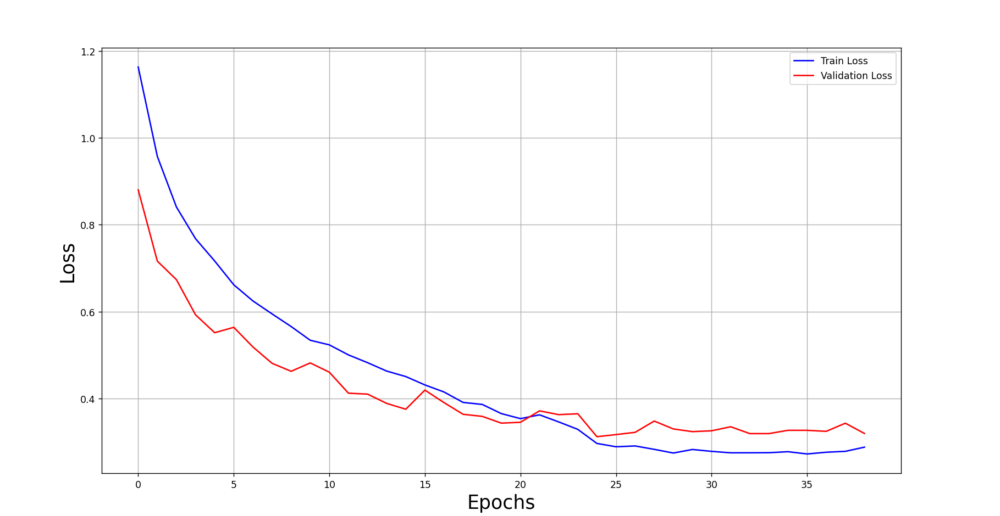
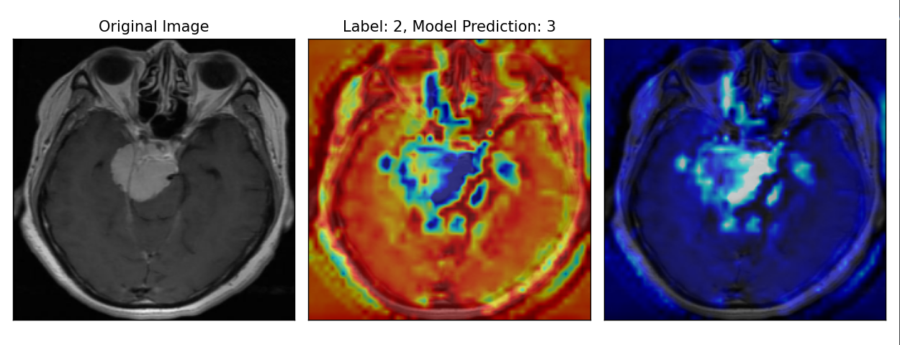
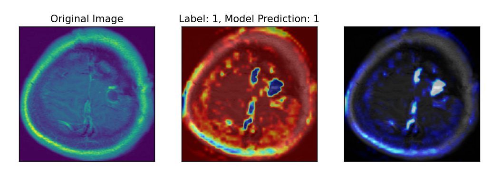
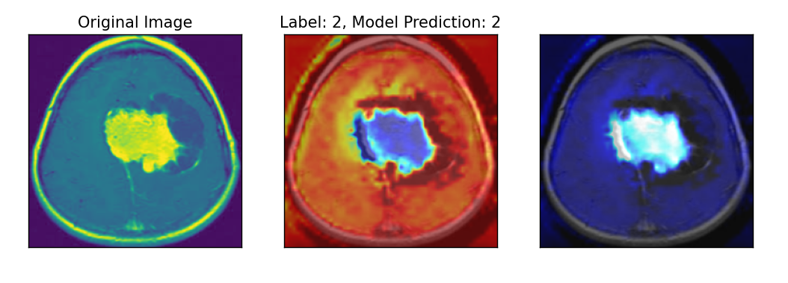
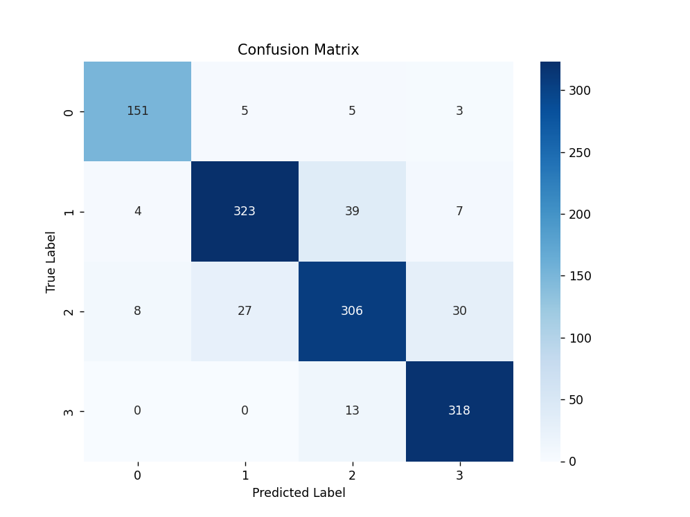

# Brain Tumor MRI Detection

According to the Central Brain Tumor Registry of the United States (CBTRUS), an estimated **1 million Americans** are currently living with a primary brain tumor. In 2023, brain tumors were the **10th leading cause of death** among both males and females, with an estimated **18,990 deaths** reported.

As machine learning continues to expand its role in healthcare, the demand for **accurate** and **ethically developed** AI models is more critical than ever. This project focuses on the automatic detection and classification of three primary types of brain tumors using MRI scans:

- **Glioma**
- **Meningioma**
- **Pituitary Tumors**

By leveraging deep learning techniques, this project aims to support early diagnosis and enhance clinical decision-making in neuro-oncology.

**Clone the repository**
```bash
git clone https://github.com/grod23/Brain-Tumor-MRI-Detection.git
cd Brain-Tumor-MRI-Detection
```

### Create Virtual enviroment
```python -m venv venv
source venv/bin/activate       # macOS/Linux
or
venv\Scripts\activate          # Windows
```
### Install Required Packages
```
pip install -r requirements.txt
```
### Run Script
```
python test.py
```
### Sample MRI Scans: Before and After Preprocessing
MRI images undergo preprocessing to normalize input, resize shapes, equalize histograms, and apply augmentations. 

### Train-Validation Loss




### Grad-CAM Visualization
Interpretability and trust are crucial for an impactful machine learning model, especially in healthcare. Professionals must understand where and why a model is making predictions. To ensure interpretability, Grad-CAM (Gradient-weighted Class Activation Mapping) is used to visualize which regions of the MRI the model focuses on when making a prediction.

<p align="center">
  
  
  
</p>


### Classification Report
                  precision    recall  f1-score   support

        No Tumor       0.94      0.94      0.94       164
          Glioma       0.90      0.87      0.88       373
      Meningioma       0.84      0.83      0.84       371
       Pituitary       0.90      0.95      0.93       331

        accuracy                           0.89      1239
       macro avg       0.90      0.90      0.90      1239
    weighted avg       0.89      0.89      0.89      1239

### Confusion Matrix
The confusion matrix helps to understand where the model is confusing different tumor types.




### Conclusion
This project demonstrates the potential of deep learning models to assist in the early and automated diagnosis of brain tumors using MRI scans. With the use of convolutional neural networks and Grad-CAM for interpretability, the model not only achieves strong performance metrics but also offers transparency in its decision-making.

Future directions include:

Incorporating 3D volumetric MRI data

Training on larger, multi-institutional datasets

Preprocessing utilizing skull-stripping. 


